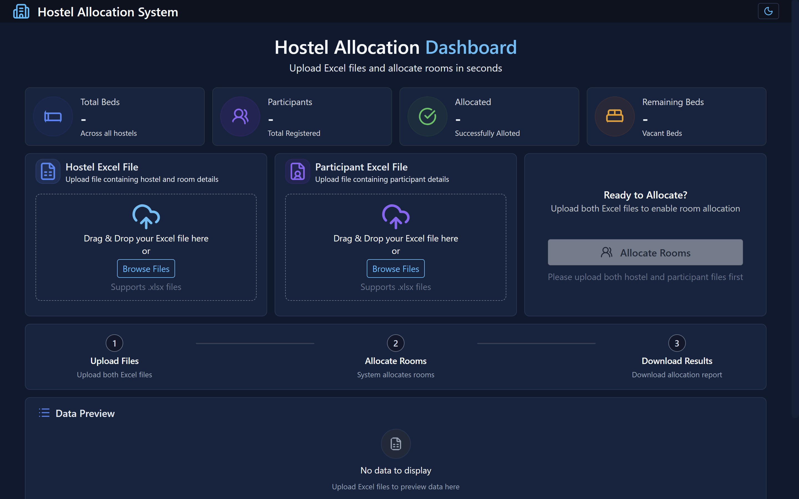
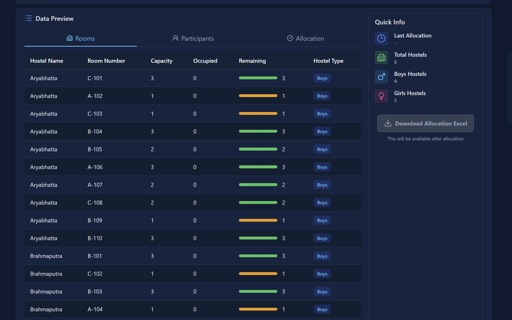
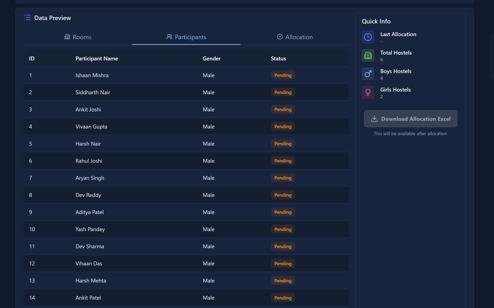
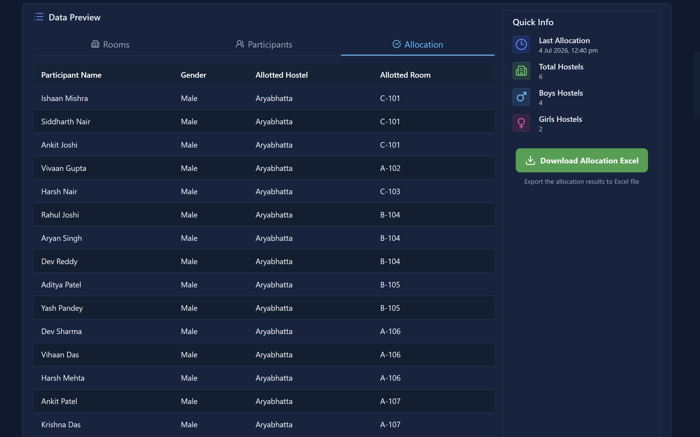

# Hostel Allotment System
🌐 **Live Demo:** https://hostel-allotment.netlify.app

A web application that automates hostel room allocation by processing hostel and participant data from Excel files. Built with SvelteKit and TypeScript, it provides an intuitive dashboard for uploading data, allocating rooms, and downloading the final allocation report.


## Live Demo
You can try the application online. It is currently hosted on Netlify.
[Hostel Allotment System](https://hostel-allotment.netlify.app/)

## Demo
<p align="center">
  
</p>

## Features
- Upload hostel data (.xlsx)
- Upload participant data (.xlsx)
- Automatic room allocation
- Gender-based allocation
- Input validation
- Download allocation results

## Tech Stack
- Svelte
- TypeScript
- Tailwind CSS
- SheetJS (xlsx)

<!-- The steps that I wrote myself, still worth it -->
<!-- ## Allocation Steps
1. Read the hostel and participant data from excel files using SheetJS library.
2. Parse the data and check for headers, and data in the file.
3. If header or data in any file is no corrent, return an error ny alert.
4. If the files are valid, they are then completely parsed, mapped to typescript defined interfaces and than saved in respective arrays.
5. Then the data preview tab processes the files as the flags change their values and files are found parsed and present.
6. Than the user click Allocate Rooms, than the allocation is done by calling allocateRooms function present in './lib/allocation.ts'.
7. This function returns data in 'allocation' named interface which is than processed in main page to display in data preview and is also converted into sheet using SheetJS and made downloadable. -->

## Allocation Workflow
1. Read the hostel and participant Excel files using the SheetJS library.
2. Validate the uploaded files by checking their headers and ensuring that required data is present.
3. If validation fails, display an appropriate error message to the user.
4. Parse the valid data, map it to the corresponding TypeScript interfaces, and store it in application state.
5. Display a preview of the parsed data before allocation.
6. When the user clicks **Allocate Rooms**, the application invokes the allocation algorithm defined in `src/lib/allocation.ts`.
7. The algorithm generates room assignments while respecting hostel capacity and gender constraints.
8. The allocation results are displayed in the dashboard and can be exported as an Excel file using SheetJS.


## Installation
To run the application locally, you can set it up on your computer and run it on localhost.
```bash
git clone https://github.com/divyansh-coder-git/hackathon-hostel-allotment-system
cd hackathon-hostel-allotment-system
npm install
npm run dev
```

## Project Structure

```tree
src
├── app.d.ts
├── app.html
├── lib
│   ├── allocation.ts
│   ├── assets
│   │   ├── favicon-1.svg
│   │   └── favicon.svg
│   └── types.ts
└── routes
    ├── +layout.svelte
    ├── +page.server.ts
    ├── +page.svelte
    └── layout.css
```
Entry Point: src/routes/+page.svelte contains the main application UI and coordinates file uploads, room allocation, and result generation.

## Screenshots
| Dashboard | Hostel Data |
|------------|--------------|
|  |  |

| Participant Data | Allocation Preview and Download |
|------------|----------|
|  |  |


## Supported Excel Format

### Hostel File

| Hostel | Room | Gender |
|---------|------|--------|
| Name 1 | 101 | Boys |
| Name 2 | 102 | Girls |

### Participant File

| Name | Gender |
|------|--------|
| Rahul | Male |
| Priya | Female |

## Future Improvements
- Authentication and role-based access
- Database integration
- Hostel preference selection
- Roommate preference support
- Admin dashboard
- PDF allocation reports

## Made by

**Divyansh Pandey**

[Portfolio](https://divyansh-pandey.netlify.app)
[LinkedIn](https://www.linkedin.com/in/divyansh-pandey-nits/)
[Instagram](https://instagram.com/divyansh_coder/)

> This project was developed as part of the ML Club recruitment process at NIT Silchar. The objective was to build a responsive web application capable of automating hostel room allocation from Excel datasets while providing an intuitive user experience.
